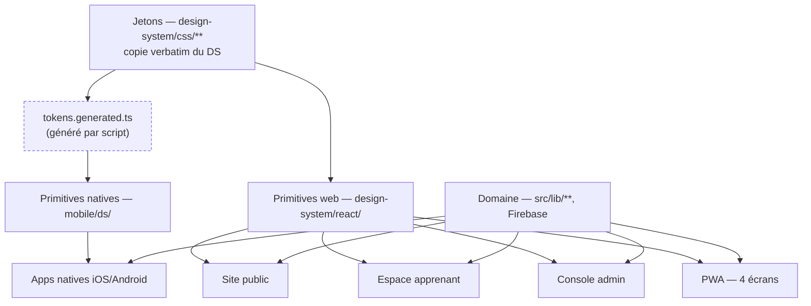

# Colonne vertébrale — Migration vers le design system Max-Morrys

## Paradigme de conception

**Jetons en portée CSS, primitives par plateforme, surfaces composées.**

Trois étages, une seule direction de dépendance. L'étage du bas ne connaît aucun des étages
au-dessus, et rien ne saute un étage.

| Étage | Où il vit | Ce qu'il contient | Ce qu'il ignore |
|---|---|---|---|
| **Jetons** | `src/design-system/css/` (copie verbatim du DS) | valeurs, maillages, verre, mouvement, replis, portée `.dk` | React, Tailwind, le produit |
| **Primitives** | `src/design-system/react/` · `mobile/ds/` | les 36 composants, un port par plateforme | les données, les routes, Firebase |
| **Surfaces** | `src/pages/` · `src/components/` · `mobile/app/` | les écrans réels, composés de primitives | les valeurs de jeton |

Ce que ce paradigme achète : **le mode sombre, les trois replis et le budget de flou se règlent
à l'étage des jetons, donc pour les quarante-deux écrans d'un coup.** C'est exactement ce que le
DS a démontré en passant la page du Club de 21 surfaces floutées à 2 sans redessiner un écran.



**Interdits de dépendance, sans exception.** Une surface n'importe jamais `design-system/css`
directement (elle passe par une primitive). Une primitive n'importe jamais `src/lib/firestore`.
`mobile/` n'importe jamais un fichier de `src/` autre que `design-system/tokens.generated.ts`.

## Invariants et règles

Trois clés par décision, gardées en anglais parce que l'outillage les lit : **Binds** — ce que la
décision lie ; **Prevents** — la divergence qu'elle empêche ; **Rule** — la contrainte que l'aval
applique.

### AD-1 — Les jetons sont copiés verbatim, jamais retapés

- **Binds :** tout
- **Prevents :** la dérive valeur par valeur entre le kit et le code — le DS pose que « si le kit dit 5 px, c'est 5 px, pas 4 », et qu'aucune valeur ne s'arrondit sur une grille de 4 ou 8
- **Rule :** `src/design-system/css/**` est une copie littérale de `Design_System_Max-Morrys/{tokens,brand}/**`. Un changement de valeur se fait **dans le DS** puis se resynchronise par `npm run ds:sync`, jamais à la main dans `src/`. `npm run ds:check` compare les deux arbres et échoue à la moindre divergence.

### AD-2 — Tailwind lit les jetons, il ne les redéfinit pas

- **Binds :** `tailwind.config.js`, les 252 fichiers TS/TSX
- **Prevents :** deux palettes concurrentes — les 47 échelles héritées (`brand-*`, `accent-*`, `plum-*`, `morrys-*`, `lagoon-*`, `coral-*`, `teal-*`) contre les jetons du DS, avec 1 979 occurrences déjà en place pour trancher au hasard
- **Rule :** `theme.extend.colors` ne contient que des entrées `var(--…)`. Les échelles héritées sont **supprimées** à la fin de la passe de migration, ce qui transforme toute occurrence oubliée en classe inexistante — visible, plutôt que silencieusement fausse. Aucun code hexadécimal n'est écrit dans un fichier TSX.

### AD-3 — Le mode sombre est une portée CSS, jamais une prop

- **Binds :** tout
- **Prevents :** le défaut que le DS a nommé — un composant à qui personne ne passe la prop retombe silencieusement sur sa valeur claire ; un disque de chrome à 60 % de blanc sous un glyphe `#ECF0F5` donne **1,4:1**, dans douze écrans à la fois
- **Rule :** `<html>` porte `class="dk"` et `data-mm-dark`. Tailwind est configuré `darkMode: ['selector', '.dk']`. Le variant `dark:` reste autorisé **pour la mise en page seulement** ; toute **couleur** passe par un jeton qui bascule seul. **Aucun composant n'accepte de prop `dark`, `theme` ou `night`.** Aucune valeur `rgba(14,17,22,…)` n'est écrite en dur : les remplissages neutres passent par `--fill-1` à `--fill-5`, qui s'inversent sous `.dk`.

### AD-4 — Le flou n'a droit qu'au chrome en position fixe, et la machine le vérifie

- **Binds :** tous les composants, tous les écrans, les deux plateformes
- **Prevents :** la reconstitution du budget dépassé que le DS a mesuré puis corrigé — 21 surfaces floutées sur la seule page du Club, dont 5 défilantes, venues de **huit composants** portant chacun un flou légitime pris seul et fatal cumulé
- **Rule :** `backdrop-filter` n'apparaît qu'à un seul endroit du dépôt, `design-system/css/brand/surfaces.css`, sur la classe `.glass`. `.glass` ne s'applique qu'à un élément en `position: fixed` ou `sticky` — en pratique la barre haute du site et la barre d'onglets basse. Tout le reste est en faux verre : `.glass-flat`, `.glass-hero`, `.glass-d`, `.truth`. `npm run ds:check` échoue sur toute autre occurrence, et le contrôle se fait **par écran assemblé**, jamais par composant isolé.

### AD-5 — Un nombre en monospace porte sa source dans le type

- **Binds :** tout affichage chiffré, les deux plateformes
- **Prevents :** le chiffre de façade non sourcé — le PRD a constaté que 98 % de complétion, 1 486 étudiants et 45 M XOF étaient contredits par la base de production
- **Rule :** le composant `<Num>` exige `source: 'db' | 'server' | { cite: string }` **et** `asOf: Date`. C'est le seul chemin du dépôt vers `--f-mono` pour un chiffre. Un nombre sans source **ne se rend pas** : l'état vide s'affiche à sa place. Un zéro daté est une valeur et s'affiche (« 0 certificat émis · relevé du 30/08 ») ; un tiret n'en est pas une. Interdits absolus, sans exception : note en étoiles, nombre d'avis, nombre d'inscrits, taux de réussite, témoignage, logo client.

### AD-6 — Les primitives sont des éléments natifs, focalisables, avec de vrais contrôles

- **Binds :** `components/forms`, `components/actions`, `components/navigation`
- **Prevents :** que les points ouverts **B** et **C** du handoff passent en production — le DS livre zéro `<input>`, `<textarea>` ou `<select>` dans tout le système, des `<label>` sans `for`, et des `<a>` sans `href` pour la barre d'onglets, la navigation latérale, la sous-navigation et le fil d'Ariane. Le DS les déclare lui-même bloquants
- **Rule :** `Field` rend un `<input>`/`<textarea>`/`<select>` réel associé à un `<label for>` ; `Button`, `IconButton`, `PillButton` rendent un `<button type>` ; toute cible de navigation rend un `<a href>` ou un `<button>` ; toute cible sans texte porte un `aria-label`. Cible tactile **≥ 44 px** (`--touch-aa`) : le dessin peut rester à 42 px, la cible s'étend par `.mm-touch-extend`. L'anneau de focus double se porte sur `:focus-visible`, jamais `:focus`. **Le port React est le moment où ces trois défauts se corrigent — ils ne se reportent pas.**

### AD-7 — Les trois replis sont déclarés une seule fois, et connaissent le thème

- **Binds :** `design-system/css`
- **Prevents :** la seconde déclaration locale qui gagne par ordre de chargement et rétablit silencieusement ce que la personne a explicitement refusé — le DS a constaté la règle violée quatre fois, avec des valeurs qui divergeaient (`.92` contre `.94`), et c'est l'ordre des `@import` qui tranchait
- **Rule :** `prefers-reduced-motion`, `prefers-reduced-transparency` et `@supports not (backdrop-filter)` n'existent **que** dans `brand/fallback.css`, chacun décliné en clair **et** sous `.dk`. Toute nouvelle surface de verre doit avoir son pendant `.lowfi .dk` — sans lui, c'est un carton blanc en mode sombre sur l'appareil le plus courant du marché visé. `ds:check` refuse toute autre occurrence dans le dépôt.

### AD-8 — Une seule source de jetons pour trois plateformes : CSS d'abord, TS généré

- **Binds :** web, PWA, applications natives
- **Prevents :** la palette qui dérive entre le web et le natif — React Native n'a ni CSS, ni `backdrop-filter`, ni `filter: blur`, et la tentation est de retaper les valeurs
- **Rule :** `scripts/ds-tokens.mjs` lit `src/design-system/css/tokens/*.css` **puis `css/overrides/*.css`**, dans l'ordre de la cascade de `styles.css`, et émet `src/design-system/tokens.generated.ts` — objet figé plus types. Le natif n'importe **que** ce fichier. Il est généré, jamais édité ; `ds:check` échoue s'il est désynchronisé.

**Le trou trouvé en portant le natif.** Le script ne lisait d'abord que `tokens/`. Les jetons
des écarts délibérés n'atteignaient donc jamais le fichier généré, et l'application native
aurait embarqué les valeurs **d'avant chaque correction** — dont le vert d'état à 3,66:1 sur
fond nuit, corrigé au web par AD-19 et resté faux sur natif. C'est précisément la dérive que
cette décision existe pour empêcher : pas une palette qui change d'un coup, mais une valeur à
la fois, dans la plateforme que personne ne regarde pendant qu'on corrige l'autre.
**Un jeton déclaré dans un écart fait partie du système au même titre qu'un jeton du kit.**

### AD-9 — Le dépôt ne devient pas un monorepo, `src/` ne bouge pas

- **Binds :** arborescence, build, déploiement
- **Prevents :** casser la chaîne qui déploie réellement — `vite build` → `dist/` → Firebase Hosting → origin-pull Cloudflare — pour un gain d'organisation. `firebase.json`, `vite.config.ts`, `tsconfig.app.json` et la CI pointent tous sur `src/` et `dist/`
- **Rule :** le web reste `src/`, alias `@`. Le DS porté vit dans `src/design-system/`, alias `@ds`. Les applications natives vivent dans `mobile/`, projet Expo autonome avec son propre `package.json` et son propre verrou. **Aucun champ `workspaces` n'est ajouté à la racine.**

### AD-10 — Le natif porte l'équivalent déclaré du verre et du maillage, pas leur copie

- **Binds :** `mobile/`
- **Prevents :** la course au pixel sur une plateforme qui n'a pas les primitives graphiques du web, et l'effondrement de performance qui suit
- **Rule :** le maillage est rendu par trois `RadialGradient` SVG **figés** — l'animation de dérive n'existe pas par défaut sur natif. Le verre est un `BlurView` (`expo-blur`) **uniquement** sur le chrome fixe ; partout ailleurs, un `View` opaque au voile de `--glass-a-flat`. Toutes les valeurs viennent de `tokens.generated.ts` (AD-8). Les équivalences sont déclarées dans `mobile/ds/README.md`, pas décidées écran par écran.

### AD-11 — Le paiement natif ne passe pas par les magasins

- **Binds :** `mobile/`, tunnel d'achat
- **Prevents :** les 15 à 30 % de commission Apple et Google, et la disparition de Wave et Orange Money de l'écran d'achat — c'est la raison même pour laquelle le DS excluait le natif. Sur une formation à 95 000 FCFA, c'est 14 250 à 28 500 F par vente
- **Rule :** l'application native n'expose **aucun** achat in-app. Le tunnel natif s'arrête à la sélection du moyen de paiement et ouvre l'URL de paiement du web dans le navigateur système. Le montant débité reste celui recalculé côté serveur, jamais celui transmis par le client.
- ⚠️ **[HYPOTHÈSE]** Suppose que la revue Apple accepte ce renvoi au titre de la ligne 3.1.1. **Non vérifié.** À trancher avant toute soumission ; le repli connu est de retirer tout achat de l'application native et de la cantonner à la consultation.

### AD-12 — Le renommage a une seule source, lue par tous

- **Binds :** les 31 fichiers mentionnant Rysmo, l'i18n, les routes
- **Prevents :** qu'un écran écrive le nom en dur et casse le renommage sans que rien ne le signale — le handoff compte treize emplacements qui lisent le nom du tuteur
- **Rule :** `Hello !` est le mot-symbole des pages web (`Wordmark` variant `hello`, dégradé `#0057BC → #F38B0A → #02AC9C`, `color` déclaré **avant** `WebkitTextFillColor`). `Rysmo` est le nom de l'application (`APP_NAME`), affiché à l'écran de lancement, à la bannière d'installation, à la connexion, à la création de compte et sur `/403`. Le tuteur lit `tutorName(profile)` — jamais une constante de composant ; défaut « Répétiteur », surchargé par `users/<uid>.tutorName`, renommable depuis l'écran de mémoire **et** depuis les préférences. `Max-Morrys` survit uniquement comme **personne** : page « Je suis Max-Morrys », signature d'article, mentions légales, « Max-Morrys Agency ». Route `/mon-espace/repetiteur`, avec redirection permanente depuis `/mon-espace/rysmo`.

### AD-13 — Les titres d'affichage sont écrits par langue, jamais traduits

- **Binds :** i18n
- **Prevents :** le titre français qui se replie tout seul et perd sa masse — le français court environ 18 % plus long, et un titre calé sur trois lignes en français en fait deux en anglais
- **Rule :** toute clé de titre d'affichage est un **tableau de lignes** (`["JE TE FORME","AU DIGITAL.","DEPUIS DAKAR."]` / `["I'LL TRAIN YOU","TO GO DIGITAL.","FROM DAKAR."]`), rendu ligne par ligne, chaque ligne insécable. **Aucun repli automatique.** Les six libellés de navigation sont écrits, pas traduits : *I'm Max-Morrys · I'll train you · I'll keep you posted · I'll push you further · I'll get you online · Talk to me*. Séparateur de milliers : espace insécable en français, virgule en anglais.

### AD-14 — La colonne de lecture ne s'élargit jamais

- **Binds :** prose, article, leçon, document
- **Prevents :** la seule règle de mise en page que le DS déclare non négociable
- **Rule :** tout conteneur de prose porte `max-width: var(--measure-prose)` — **68 caractères**, à 390 px comme à 1400. Aucune valeur locale, aucune exception responsive. L'espace gagné va à la marge et à la navigation.

### AD-15 — Les routes bilingues sont une table unique, vérifiée à l'unicité au chargement

- **Binds :** routage
- **Prevents :** que deux segments anglais entrent en collision et produisent une page inatteignable dans une langue et pas dans l'autre — **sans aucune erreur de compilation pour le signaler**
- **Rule :** la table vit dans un module unique. Une assertion d'unicité s'exécute au chargement du module : échec dur en développement, journalisation en production.

### AD-16 — Le mouvement ne porte que `transform` et `opacity`

- **Binds :** tout
- **Prevents :** la ré-introduction du coût de recomposition sur le profil d'appareil visé — 2 Go de mémoire, 4 cœurs, qui *est* le marché et non le cas limite
- **Rule :** aucune transition ni animation sur `width`, `height`, `top`, `left`, `margin`, `padding`, `inset`. **Exception unique, déjà écrite et fermée** : le remplissage de barre de progression et le curseur du fil de lecture (`@keyframes barfill`, `.prog-fill`), bornés à un élément de 3 à 8 px de haut sans enfant. Aucune nouvelle exception. Quatre durées et deux courbes, jamais d'autres. `ds:check` grep les propriétés interdites et échoue.

### AD-17 — La PWA n'interrompt jamais, et son seul argument est le forfait

- **Binds :** PWA
- **Prevents :** la modale d'installation qui interrompt exactement ce qu'on était venu faire
- **Rule :** l'invitation est un bandeau bas, posé après la **deuxième** visite, **jamais** en modale. Le libellé parle de la connexion et du forfait — « Garde tes leçons hors connexion. » — jamais « installe notre app ». Chaque ressource hors connexion affiche **son poids en monospace**. Le centre de notifications est le **seul canal sortant du produit**, cinq types : inscription, certificat, contenu, club, système. Aucun écran ne promet un e-mail : le produit n'a aucun canal d'envoi.

### AD-18 — Le voile de lisibilité remonte, et l'encre tertiaire cesse de porter du texte

- **Binds :** jetons, `brand/mesh.css`, toutes les surfaces, les deux modes
- **Prevents :** le point A du handoff — l'encre secondaire sous 4,5:1 et la tertiaire sous 3:1 sur le fond réel, que le DS déclare non conforme
- **Rule :** le voile clair passe à **`.60` / `.78` / `.90`** (au lieu de `.42` / `.72` / `.90`) et le voile nuit à **`.62` / `.86` / `.94`**. `--ink-3` et `--text-faint` **ne portent jamais de texte** : ils restent aux filets, aux puits d'icônes, aux points d'étape et à l'état désactivé — exempté par WCAG 1.4.3 en tant que composant inactif. Tout texte aujourd'hui sur `--text-faint` remonte sur `--ink-2`. `ds:check` refuse `color: var(--ink-3)` et `var(--text-faint)` hors d'une règle `:disabled`.

**Mesuré le 30 août 2026**, WCAG 2.x sur la pile réelle, cinq lobes croisés avec trois niveaux de verre :

| | Voile `.42` (avant) | Voile `.60` (après) | Verdict |
|---|---|---|---|
| `--ink` `#0E1116` | 12,4:1 | **14,21:1** | conforme partout |
| `--ink-2` `#5A6472` | **3,93:1** | **4,51:1** | conforme |
| `--ink-3` `#98A1AE` | 1,96:1 | 1,96:1 | **aucun voile ne le sauve** |

`--ink-3` fait **2,61:1 sur blanc pur** : il échouait avant que le maillage existe, et plafonne à
2,51:1 même sous un voile à 94 %. Le levier est le jeton, pas le voile — d'où le second volet
de la règle.

**En mode sombre, le voile seul ne suffit pas non plus** pour `--ink-2` `#A2ADBB` (2,15:1 à `.42`,
3,89:1 encore à `.70`). Ce qui résout : le voile est un **dégradé**, et `.42` ne vaut qu'en haut
d'écran, là où seul vit le titre d'affichage en Fraunces 900 à 41–74 px — du grand texte, seuil
3:1, tenu à **4,28:1**. Le corps de texte vit plus bas, où le voile est déjà à `.78`–`.94`.
**Corollaire de mise en page, contraignant : aucun texte de corps ne se place dans le premier
tiers d'un écran à maillage.**

### AD-19 — Les trois couleurs d'état ont aussi une version nuit

- **Binds :** jetons, tout message d'état, les deux plateformes
- **Prevents :** le même piège que les quatre teintes de marque, une porte plus loin — `tokens/dark.css` fait exactement ce qu'il documente pour `--mm-bleu` et consorts, puis oublie `--ok`, `--warn` et `--stop`
- **Rule :** `.dk` redéclare `--ok` `#2BD18B`, `--warn` `#FFB24D`, `--stop` `#FF8A80`, dans `overrides/ad-19-etats-nuit.css`.

**Mesuré le 30 août 2026** sur `#0B0E13` : `--ok` `#0F7B52` **3,66:1**, `--warn` `#8A4B00`
**2,84:1**, `--stop` `#B4231F` **2,95:1**. Trois couleurs qui portent « c'est validé »,
« attention » et « ça a échoué » — les messages qu'on peut le moins se permettre de rendre
illisibles.

**Deux des trois valeurs ne sont pas un choix :** `--warn` `#8A4B00` est au caractère près la
valeur de `--mm-orange-t`, que `dark.css` fait déjà pointer sur `#FFB24D` ; et `dark.css`
déclare déjà `--error-ring: rgba(255,138,128,.2)`, soit `#FF8A80`. Le système les avait
retenues ailleurs sans faire le lien. Seul le vert est un arbitrage : franchement vert, pour
ne pas se confondre avec le teal nuit `#3FD9C6` — deux signaux différents ne partagent pas
une teinte.

### AD-20 — Le corail a aussi une version texte

- **Binds :** l'entrée « agence » de la barre haute, tout texte corail, les deux plateformes
- **Prevents :** que le système demande une couleur qu'il ne fournit pas — il donne au corail un rôle de **texte** sans en déclarer de version lisible
- **Rule :** `--mm-corail-t` `#C22A3C` (5,69:1 sur blanc) en clair ; sous `.dk` il pointe sur `#FF6E7F` (7,17:1). Exposé à Tailwind en `text-corail-txt`. La teinte pleine `--mm-corail` ne s'écrit jamais sur fond clair.

Le système déclare une version texte pour chaque teinte trop claire sur blanc — `--mm-orange-t`
`#8A4B00` (l'orange fait 2,47:1), `--mm-teal-t` `#00695E` (le teal fait 2,84:1), `--mm-violet-t`
pour les prix du Club. Il oublie le corail, **mesuré à 2,70:1** : entre les deux autres, donc du
même côté de la ligne qu'eux.

Ce ne serait qu'une teinte inutilisée si le système ne lui confiait pas explicitement du texte :
« *L'agence vit hors des quatre verbes — séparateur dans la barre haute, entrée en corail : elle
ne se range pas sous « Je te digitalise », c'est une autre promesse et un autre client.* » Une
entrée de navigation est du texte.

**En nuit, rien à corriger** : `#FF6E7F` donne 7,17:1 sur `#0B0E13`. La version texte pointe donc
sur la teinte pleine sous `.dk` — exactement ce que `dark.css` fait déjà pour `--mm-orange-t` et
`--mm-teal-t`, dont les valeurs claires sont des teintes *foncées*, illisibles en nuit.

## Conventions de cohérence

| Sujet | Convention |
|---|---|
| **Nommage des fichiers** | Primitives : `PascalCase.tsx` sous `src/design-system/react/<groupe>/`. Un composant par fichier, export nommé, jamais d'export par défaut. Les groupes sont ceux du DS : `actions`, `brand`, `data`, `forms`, `navigation`, `surfaces`. |
| **Nommage des classes CSS** | Préfixe `mm-` pour les utilitaires du DS (`.mm-num`, `.mm-eyebrow`, `.mm-dsp`, `.mm-prose`, `.mm-press`). Les recettes de surface gardent leurs noms du DS (`.glass`, `.glass-flat`, `.truth`, `.mesh`, `.m-forme`). Aucun nouveau nom n'est inventé sans entrée dans le DS. |
| **Territoires** | Quatre valeurs, et seulement quatre : `forme` · `informe` · `transforme` · `digitalise`. L'agence est **hors territoire** — pas de cinquième valeur, un traitement à part. Le type `Territory` est l'union littérale, jamais `string`. |
| **Couleur en TSX** | Interdite en dur. Une couleur se lit par classe Tailwind pointant sur `var(--…)`, ou par `style={{ color: 'var(--mm-bleu)' }}`. Trois exceptions assumées, sur des surfaces colorées qui ne changent pas de mode : curseur blanc de l'interrupteur, bouton de lecture de `MediaCard`, pastille blanche de `LogoMark`. |
| **Dates et nombres** | Un nombre affiché passe par `<Num>` (AD-5). Les dates de relevé sont des `Date` en UTC, formatées à l'affichage selon la langue. Toute case de relevé porte sa date ou affiche « non relevé ». |
| **Forme d'erreur** | Motif réel, conséquence, sortie — dans cet ordre. Jamais d'excuse, jamais « oups ». Message **sous** le champ, fondu de 220 ms, **pas de secousse**. `error: unknown` dans les `catch`, conformément au dépôt. |
| **États de chargement** | Squelette à la forme exacte du contenu, pour que rien ne saute. **Jamais de rond qui tourne.** Sur un bouton : libellé conservé plus un liseré qui balaie. |
| **Voix** | Tutoiement intégral, première personne du singulier, jamais « nous ». Aucun emoji nulle part — les seuls unicodes décoratifs admis sont le point médian `·` et les guillemets français. Aucune promesse d'e-mail. |
| **Icônes** | Un seul jeu, celui du DS (`assets/icons/`, 29 SVG plus 8 en ligne). Pour un glyphe absent : Lucide, posé à 2,2 px de trait. **Jamais deux familles sur un même écran** — ce qui met fin à la cohabitation actuelle `lucide-react` / `@phosphor-icons/react`. |
| **Prop de thème** | N'existe pas (AD-3). Une revue refuse toute prop nommée `dark`, `theme`, `night` ou `variant="dark"`. |

## Pile

Vérifiée dans le dépôt le 30 août 2026. Le code en est propriétaire une fois posé.

| Nom | Version |
|---|---|
| React | 18.3.1 |
| TypeScript | 5.5.3 |
| Vite | 5.4.2 |
| Tailwind CSS | 3.4.1 — **config JS, pas la syntaxe v4** |
| React Router | 7.13.1 — data router |
| Firebase JS SDK | 12.9.0 |
| i18next · react-i18next | 26.3.2 · 17.0.8 |
| framer-motion | 12.38.0 |
| Vitest | 2.1.9 |
| Fraunces · Schibsted Grotesk · JetBrains Mono | via Google Fonts — auto-hébergement différé |
| Expo SDK · React Native | **[HYPOTHÈSE] à figer sur la version courante au moment d'initialiser `mobile/`** |
| expo-blur · react-native-svg · expo-router | **[HYPOTHÈSE] idem** |

## Amorce structurelle

```text
maxmorrys.me-main/
  Design_System_Max-Morrys/     # source de vérité, lecture seule, jamais éditée par le produit
  src/
    design-system/
      css/                      # copie verbatim de tokens/ et brand/ (AD-1)
      react/                    # les 36 primitives, port DOM (AD-6)
        actions/ brand/ data/ forms/ navigation/ surfaces/
      tokens.generated.ts       # généré (AD-8), jamais édité
      index.ts                  # barrel — le seul point d'entrée des surfaces
    components/                 # composants produit, composés de primitives
    pages/                      # les surfaces web
    lib/                        # domaine — Firestore, marque, club, agence…
    i18n/                       # table de routes bilingue (AD-15), titres par langue (AD-13)
  mobile/                       # projet Expo autonome (AD-9)
    ds/                         # port natif des primitives (AD-10)
    app/                        # écrans, expo-router
    package.json                # verrou propre, aucun workspace racine
  scripts/
    ds-sync.mjs                 # DS -> src/design-system/css (AD-1)
    ds-tokens.mjs               # CSS -> tokens.generated.ts (AD-8)
    ds-check.mjs                # les six règles de revue, exécutables (AD-4, 5, 7, 16)
```

### Enveloppe opérationnelle

| Cible | Chaîne | Ce qui change |
|---|---|---|
| Web | `vite build` → `dist/` → Firebase Hosting → origin-pull Cloudflare | **rien** — AD-9 protège cette chaîne |
| PWA | même chaîne, plus `public/manifest.webmanifest` et un service worker | `theme_color` passe de `#0c93e7` aux jetons du DS ; icônes régénérées |
| Natif | EAS Build, hors de la CI existante | nouvelle chaîne, isolée dans `mobile/` |

`ds:check` s'exécute dans la CI existante (`.github/workflows/ci.yml`), au même rang que
`typecheck` et `lint`. **Une des six règles violée casse la build** — c'est la seule façon dont
une règle invisible sur une capture d'écran se fait respecter.

## Carte capacité → architecture

| Surface | Vit dans | Gouvernée par |
|---|---|---|
| Site public — 15 pages, 1280 px | `src/pages/*.tsx` | AD-2, AD-4, AD-13, AD-14, AD-15 |
| Espace apprenant — 10 onglets, 390 px | `src/pages/lms/**` | AD-3, AD-5, AD-6, AD-12 |
| Console d'administration — 19 écrans, nuit | `src/pages/admin/**` | AD-3, AD-5, AD-7 |
| Tunnel d'achat et certificat | `src/pages/lms/{Checkout,PaymentReturn,Certificate}.tsx` | AD-5, AD-11, AD-16 |
| PWA — 4 écrans | `src/components/pwa/**`, `public/` | AD-17, AD-5 |
| Applications natives iOS/Android | `mobile/**` | AD-8, AD-10, AD-11, AD-12 |
| Socle du design system | `src/design-system/**` | AD-1, AD-6, AD-7, AD-8 |

## Différé

- **Auto-hébergement des fontes.** Le DS vise ≤ 95 Ko contre ~200–220 Ko par Google Fonts, mais aucun binaire n'a été fourni. Se mesure après la première build réelle ; ne bloque aucune surface.
- **Publication sur les magasins.** Comptes développeur, signature, EAS, capture d'écran de fiche : hors du périmètre du socle, et dépend de la levée de l'hypothèse d'AD-11.
- **Remplacement des portraits générés par IA (FR-084)** et de toute photographie. Les emplacements restent des dégradés étiquetés « Photographie à faire ».
- **Remplacement du PNG du logo par un SVG.** `logo-mm-icon.png` pèse 273 Ko en 1254 × 1254 pour un rendu à 42–92 px, soit 30 % du budget de 900 Ko. `Wordmark` rend la même marque en type pur pour 0 octet ; le PNG ne survit que sur pastille blanche.
- **Migration de `@phosphor-icons/react` vers le jeu unique.** La convention est posée ; l'exécution suit la passe de migration et ne la précède pas.
- **Animation du maillage sur natif.** Figée par AD-10 ; se rouvre si une mesure sur appareil réel montre que ça tient.

## Questions tranchées

**Point A du handoff — le contraste sur le fond réel.** Posé ouvert par le DS, tranché le
30 août 2026 par le porteur : *remonter le voile*. La mesure a montré que ce choix règle l'encre
secondaire mais ne peut pas régler la tertiaire, et **AD-18** porte les deux volets.
